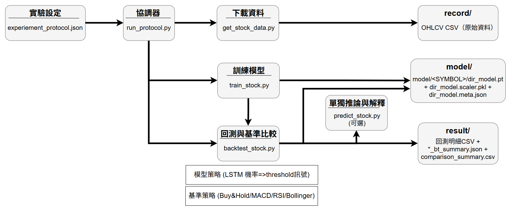

# Adaptive Multi-Granularity Neural Trading System

這份文件會一步一步教你如何在本專案中執行：

1. 資料下載 (`get_stock_data.py`)  
2. 模型訓練 (`train_stock.py`)  
3. 推論 (`predict_stock.py`)  
4. 回測 (`backtest_stock.py`)  
5. Protocol 批次實驗 (`run_protocol.py`)

## Flow Diagram



流程圖展示了本專案的端到端管線：`experiment_protocol.json` 由 `run_protocol.py` 協調後，驅動資料下載、模型訓練與回測比較。訓練會產生 `model/<SYMBOL>/` 下的模型與可重現 artifacts（`pt/scaler/meta`），推論可獨立執行並輸出解釋欄位，而回測會在相同評估區段下比較 LSTM 與基準策略，最終輸出到 `RESULTS_DIR`（預設 `backtest_results/`，於 `.env` 設定；含明細、summary 與 comparison 總表）。

**互動式入口**：在專案根目錄執行 `uv run main.py` 可開啟選單。完整用法（主選單對照表、前置條件、離開方式）見下文 **使用 `main.py`** 一節；下載資料的終端畫面與程式呼叫鏈見 **Main 選單：下載資料**。

### Project structure

```text
EE4016-Project
|
+-- main.py
+-- get_stock_data.py
+-- train_stock.py
+-- backtest_stock.py
+-- predict_stock.py
+-- run_protocol.py
+-- validate_paths.py
|
+-- app
|   |
|   +-- menu.py
|   +-- state.py
|   +-- constants.py
|   +-- paths.py
|   |
|   +-- actions
|   |   `-- stock_actions.py
|   |
|   +-- services
|   |   `-- discovery.py
|   |
|   +-- ui
|   |   `-- cli.py
|   |
|   `-- menus
|       +-- data_menu.py
|       +-- train_menu.py
|       +-- backtest_menu.py
|       +-- pipeline_menu.py
|       +-- predict_menu.py
|       `-- results_menu.py
|
+-- historical_data/     (或 .env 的 SAVE_DIR)
+-- model/               (或 .env 的 MODEL_DIR)
+-- backtest_results/    (或 .env 的 RESULTS_DIR)
```

### 使用 `main.py`

`main.py` 是互動式入口腳本：**不解析命令列參數**，啟動後會進入主選單迴圈（`app.menu.interactive_menu`），在終端清屏、列印選項並等待你輸入數字。

**前置**：在專案根目錄完成 `uv sync`，並依本文件 **1) 環境需求**、**2) 先設定 `.env`** 完成設定，使 `SAVE_DIR`／`MODEL_DIR`／`RESULTS_DIR` 與實際資料夾一致。選單會從 `SAVE_DIR` 掃描 `*.csv` 供訓練／回測／推論挑檔。

**啟動**（工作目錄須為專案根目錄）：

```powershell
uv run main.py
```


**主選單選項**

| 輸入 | 區塊     | 行為（對應腳本）                                            |
| ---- | -------- | ----------------------------------------------------------- |
| `1`  | Data     | 依 ticker／interval／歷史區間下載（`get_stock_data.py`）    |
| `2`  | Train    | 從歷史 CSV 挑檔並推斷 ticker 後訓練（`train_stock.py`）     |
| `3`  | Backtest | 挑 CSV 與模型回測（`backtest_stock.py`）                    |
| `4`  | Predict  | 挑 CSV 與模型推論（含解釋欄位）（`predict_stock.py`）       |
| `5`  | Pipeline | 執行 protocol runner（`run_protocol.py`）                   |
| `6`  | Results  | 讀取並顯示 `RESULTS_DIR` 下的 `comparison_summary.csv` 摘要 |
| `0`  | —        | 結束程式                                                    |

輸入不在上表中的內容會提示重新選擇。在要求輸入時按 **Ctrl+C**（或送達 EOF）會顯示離開訊息並結束。進入子選單後另有獨立選項；多數子選單以 **`0` 返回上一層**。

下載資料的逐步終端畫面見下方 **「Main 選單：下載資料（終端畫面流程）」**。

### Main 選單：下載資料（終端畫面流程）

以下為從 `main.py` 進入 Data menu、手動下載一檔的畫面流程（輸出檔名與路徑以 `SAVE_DIR` 為準，圖中範例為預設資料夾名）。

```text
┌──────────────────────────────────────────────────────────────────────┐
│ Terminal                                                            │
│ > uv run main.py                                                    │
└──────────────────────────────────────────────────────────────────────┘
                               │
                               ▼
┌──────────────────────────────────────────────────────────────────────┐
│ ====================== MAIN MENU ======================             │
│ [Data]                                                               │
│   1. Data menu                                                       │
│ ...                                                                  │
│ Enter your choice: 1                                                 │
└──────────────────────────────────────────────────────────────────────┘
                               │
                               ▼
┌──────────────────────────────────────────────────────────────────────┐
│ ==================== Stock ML - Data Menu ====================      │
│ [Download]                                                           │
│   1. Download by ticker/interval/historical range (get_stock_data.py)│
│                                                                      │
│ Enter your choice [1]:                                               │
└──────────────────────────────────────────────────────────────────────┘
                               │
                               │ (manual path: choose 1)
                               ▼
┌──────────────────────────────────────────────────────────────────────┐
│ tickers (e.g. AAPL,MSFT) [default=AAPL]:                            │
│ Selected tickers: AAPL                                               │
│                                                                      │
│ interval (e.g. 1d, 1h, 5m) [default=1d]:                            │
│ Selected interval: 1d                                                │
│                                                                      │
│ historical range (e.g. 30d, 6mo, 2y), max 10y [default=10y]:        │
│ Selected historical range: 10y                                       │
└──────────────────────────────────────────────────────────────────────┘
                               │
                               ▼
┌──────────────────────────────────────────────────────────────────────┐
│ ---------------------- Download Summary ----------------------       │
│ Tickers      : AAPL                                                  │
│ Interval     : 1d                                                    │
│ Historical   : 10y                                                   │
│ Interval Max : 10y                                                   │
│ ------------------------------------------------------------------   │
│ Ready to download? [Y/n]:                                            │
└──────────────────────────────────────────────────────────────────────┘
                      │ Yes                              │ No
                      ▼                                  ▼
┌──────────────────────────────────────┐   ┌───────────────────────────┐
│ Downloading AAPL, last 10y, ...      │   │ Cancelled.                │
│ Saved <SAVE_DIR>/AAPL_10y_1d.csv     │   │ Press Enter to continue...│
│ Press Enter to continue...            │   └───────────────────────────┘
└──────────────────────────────────────┘
```

### Main 選單：下載資料（程式呼叫鏈）

```text
                           ┌──────────────────────┐
                           │       main.py        │
                           │  main()              │
                           └──────────┬───────────┘
                                      │
                                      ▼
                    ┌──────────────────────────────────┐
                    │ app/menu.py                      │
                    │ interactive_menu()               │
                    │ MENU_ACTIONS["1"] -> run_data... │
                    └────────────────┬─────────────────┘
                                     │
                                     ▼
                   ┌──────────────────────────────────┐
                   │ app/menus/data_menu.py           │
                   │ run_data_menu()                  │
                   └──────────────┬───────────────────┘
                                  │
                                  ▼
                  ┌──────────────────────────────────┐
                  │ manual parameter path            │
                  │ tickers / interval / range       │
                  └──────────────┬───────────────────┘
                                 │
                                 ▼
       ┌────────────────────────────────────────────────────────────┐
       │ app/actions/stock_actions.py                              │
       │ run_script(...)                                            │
       └──────────────┬─────────────────────────────────────────────┘
                       │
                       ▼
        ┌────────────────────────────────────────────────────────────┐
        │ subprocess.run([sys.executable, "get_stock_data.py", ...]) │
        └──────────────┬─────────────────────────────────────────────┘
                       │
                       ▼
        ┌────────────────────────────────────────────────────────────┐
        │ get_stock_data.py                                          │
        │ parse args -> validate -> yfinance -> CSV -> SAVE_DIR      │
        └──────────────┬─────────────────────────────────────────────┘
                       │
                       ▼
                <SAVE_DIR>/<TICKER>_<RANGE>_<INTERVAL>.csv
```

**下載流程相關模組依賴**

```text
app/menus/data_menu.py
  ├── app/ui/cli.py
  │     ├── ask(), ask_yes_no(), clear_screen(), pause()
  ├── app/constants.py  (INTERVAL_LIMITS)
  ├── app/services/discovery.py
  │     ├── duration_to_years(), max_lookback_label()
  └── app/actions/stock_actions.py  (run_script)

app/services/discovery.py
  ├── app/state.py  (load_state, save_state)
  └── app/paths.py  (PROJECT_ROOT, SAVE_DIR, RESULTS_DIR, MODEL_DIR, STATE_PATH)
```

---

## 1) 環境需求

- Windows / macOS / Linux
- Python 3.12+
- `uv` 套件管理工具

若尚未安裝 `uv`，可參考官方文件安裝。安裝後，在專案根目錄執行：

```powershell
uv sync
```

這會建立 `.venv` 並安裝相依套件。

---

## 2) 先設定 `.env`（第一次執行必做）

複製 `.env_example` 為 `.env`。所有主要資料夾路徑都在此設定（相對路徑以專案根目錄為準，亦可用絕對路徑）。

### `.env` 範例

```env
SAVE_DIR=historical_data
RESULTS_DIR=backtest_results
MODEL_DIR=model
```

或使用絕對路徑，例如：

```env
SAVE_DIR=C:/Users/your_name/Desktop/EE4016/Project/historical_data
RESULTS_DIR=C:/Users/your_name/Desktop/EE4016/Project/backtest_results
MODEL_DIR=C:/Users/your_name/Desktop/EE4016/Project/model
```

設定完成後，再進行語法檢查。

## 3) 先做語法檢查（建議每次改完先跑）

```powershell
uv run python -m py_compile main.py get_stock_data.py train_stock.py predict_stock.py backtest_stock.py run_protocol.py
```

若沒有任何輸出，代表語法檢查通過。

---

## 4) 最小可跑流程（單一股票 AAPL）

### Step 1: 下載資料

```powershell
uv run get_stock_data.py --ticker AAPL --years 5 --interval 1d
```

預期輸出檔案：

- `historical_data/AAPL_5y_1d.csv`

### Step 2: 訓練模型

```powershell
uv run train_stock.py --csv_dir historical_data --ticker AAPL --save_model model.pt --window 30 --epochs 5 --seed 42 --eval_threshold 0.5
```

預期輸出檔案：

- `model/AAPL/model.pt`
- `model/AAPL/model.scaler.pkl`
- `model/AAPL/model.meta.json`

### Step 3: 推論

```powershell
uv run predict_stock.py --csv historical_data/AAPL_5y_1d.csv --model model/AAPL/model.pt
```

預期輸出檔案：

- `backtest_results/AAPL/AAPL_5y_1d_pred.csv`
- （可能）`backtest_results/AAPL/AAPL_5y_1d_bad.csv`

### Step 4: 回測（含 baseline 比較）

```powershell
uv run backtest_stock.py --csv historical_data/AAPL_5y_1d.csv --model model/AAPL/model.pt --protocol experiment_protocol.json --eval_split test
```

預期輸出檔案：

- `backtest_results/AAPL/AAPL_5y_1d_bt.csv`
- `backtest_results/AAPL/AAPL_5y_1d_bt_summary.json`

---

## 5) Protocol 模式（建議報告展示用）

專案已提供 `experiment_protocol.json`，內含：

- 固定 ticker universe
- 固定 data windows
- 固定 split ratio
- baseline 參數（MACD / RSI / Bollinger）

### 4.1 用 protocol 下載資料

```powershell
uv run get_stock_data.py --protocol experiment_protocol.json --window_idx 0
```

`window_idx` 對應 `experiment_protocol.json` 的 `data_windows` 索引。

### 4.2 用 protocol 訓練（split 自動對齊）

```powershell
uv run train_stock.py --csv_dir historical_data --ticker AAPL --save_model model.pt --window 30 --epochs 5 --protocol experiment_protocol.json
```

### 4.3 一鍵跑 protocol 批次流程

```powershell
uv run run_protocol.py --protocol experiment_protocol.json --window_idxs 0 --epochs 1
```

這會自動執行：

1. 下載資料  
2. 訓練  
3. 回測  
4. 輸出彙總比較表

預期輸出檔案：

- `backtest_results/comparison_summary.csv`

---

## 6) 重要設計說明（你在報告可引用）

- **Leakage control**：Scaler 僅在 train split `fit`，val/test/predict/backtest 只 `transform`。  
- **Reproducibility**：固定 seed + DataLoader generator；metadata 記錄參數、版本、SHA256、命令、git hash。  
- **Fair comparison**：Model 與 baseline 在相同 test 區段與相同 fee 下比較。  
- **Evaluation enhancement**：同時輸出 predictive metrics（Accuracy/F1）與 financial metrics（Return/Sharpe/MDD/Win Rate/Turnover）。

---

## 7) 常見錯誤與排查

### A) `scaler file not found`

原因：尚未先跑訓練，或 `--model` 路徑錯。  
解法：先確認 `model/<SYMBOL>/*.scaler.pkl` 是否存在，且與 `--model` 同 basename。

### B) `Insufficient rows for window`

原因：資料筆數不足或 `window` 太大。  
解法：降低 `--window`（如 30 -> 10）或下載更長期間資料（例如 5y）。

### C) `No CSV in ... for ticker ...`

原因：`historical_data` 中找不到對應檔名。  
解法：先跑 `get_stock_data.py`，並確認檔名形如 `AAPL_5y_1d.csv`。

### D) 指標結果波動很大

原因：樣本或 window 太小、epoch 太少。  
解法：固定 seed、增加資料長度、增加 epochs，並用 protocol 批次做平均比較。

---

## (1-minute) Quick Start 

下列指令為「純 CLI」最小流程。若要以互動選單完成下載／訓練／回測等步驟，可在 `uv sync` 與 `.env` 就緒後改執行 `uv run main.py`，說明見 **使用 `main.py`** 一節。

在專案根目錄直接依序執行：

```powershell
uv sync
uv run python -m py_compile main.py get_stock_data.py train_stock.py predict_stock.py backtest_stock.py run_protocol.py
uv run get_stock_data.py --protocol experiment_protocol.json --window_idx 0
uv run train_stock.py --csv_dir historical_data --ticker AAPL --save_model model.pt --window 30 --epochs 5 --protocol experiment_protocol.json
uv run predict_stock.py --csv historical_data/AAPL_5y_1d.csv --model model/AAPL/model.pt
uv run backtest_stock.py --csv historical_data/AAPL_5y_1d.csv --model model/AAPL/model.pt --protocol experiment_protocol.json --eval_split test
uv run run_protocol.py --protocol experiment_protocol.json --window_idxs 0 --epochs 1
```

Quick Start 產出重點：
- 模型與 artifacts：`model/AAPL/model.pt`, `model.scaler.pkl`, `model.meta.json`
- 推論結果：`backtest_results/AAPL/AAPL_5y_1d_pred.csv`
- 回測結果：`backtest_results/AAPL/AAPL_5y_1d_bt_summary.json`
- 批次比較：`backtest_results/comparison_summary.csv`
