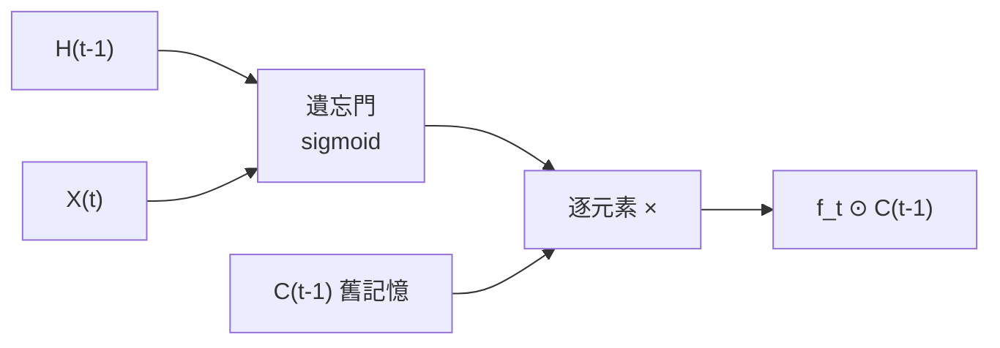
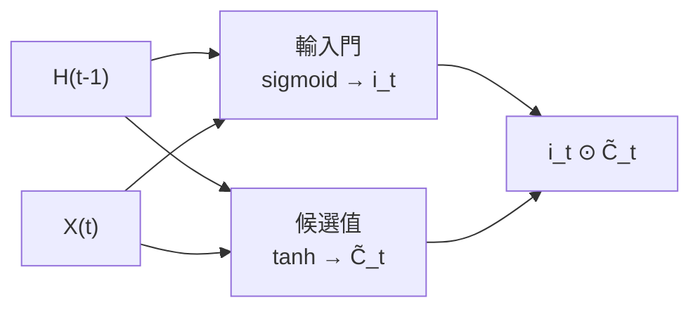
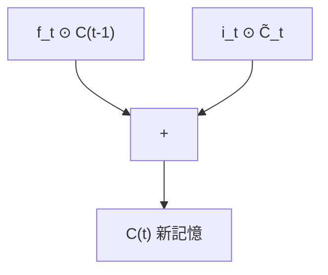
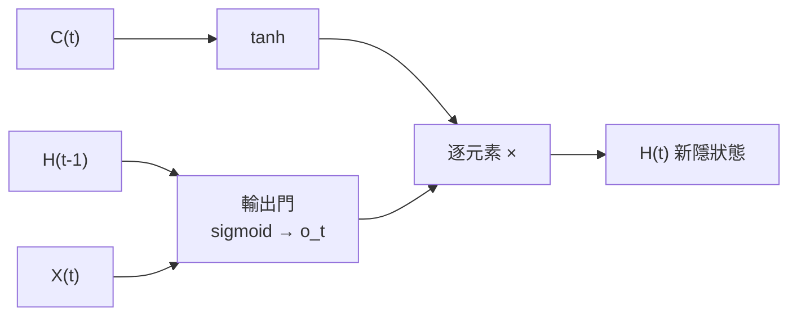
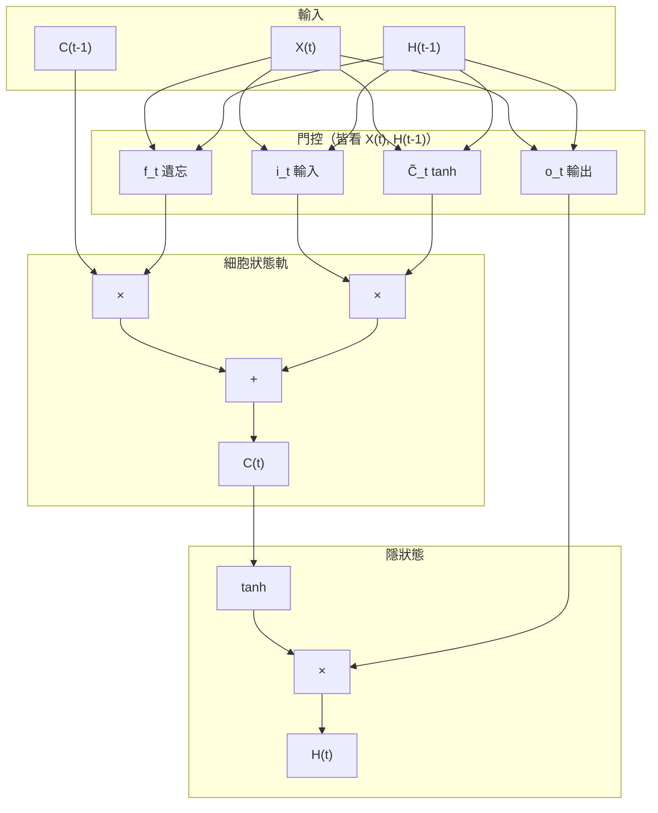

# LSTM 單一時間步：內部流程（對照互動教學）

本文依「**LSTM 細胞內部機制**」類互動視覺化的**階段順序**整理：**遺忘門 → 輸入門（含候選值）→ 細胞狀態更新 → 輸出門**。  
每個時間步 \(t\) 的輸入為 **當前特徵向量 \(X_t\)**、**上一時步隱狀態 \(H_{t-1}\)**、**上一時步細胞狀態 \(C_{t-1}\)**；輸出為 **\(C_t\)**（長期記憶軌）與 **\(H_t\)**（本步對外輸出／短程資訊）。

與本專案：`train_stock.py` 的 `nn.LSTM` 在底層即重複執行下列邏輯，沿 `window` 個時間步展開；你只需把 **\(X_t\)** 想成「第 \(t\) 根 K 線的 `d_in` 維特徵（已標準化）」。

---

## 階段總覽（與教學動畫「下一步」一致）

| 順序 | 階段 | 白話 |
|------|------|------|
| 1 | **遺忘門（Forget Gate）** | 從舊記憶 \(C_{t-1}\) 決定丟掉多少（逐維 0～1） |
| 2 | **輸入門（Input Gate）** | 決定「新資訊」哪些維要寫入，並用 tanh 產生候選更新量 |
| 3 | **細胞狀態更新（Update \(C_t\)）** | 濾過的舊記憶 **加上** 新寫入，得到 \(C_t\) |
| 4 | **輸出門（Output Gate）** | 從更新後的 \(C_t\) 挑出本步要輸出的 \(H_t\) |

---

## 階段 1：遺忘門

- **輸入**：\(H_{t-1}\)、\(X_t\) 串接（實作上為一次仿射變換 + sigmoid）。
- **輸出**：遺忘係數 \(f_t\)（與 \(C_{t-1}\) 同形狀，元素在 \((0,1)\)）。
- **作用**：\(f_t \odot C_{t-1}\) —— 愈接近 0 表示該維舊記憶愈多被清掉。

---

## 階段 2：輸入門與候選值

- **輸入門（sigmoid）**：\(i_t\)，決定候選新資訊各維「寫入強度」。
- **候選細胞（tanh）**：\(\tilde{C}_t\)，產生要加進記憶軌的內容。
- 兩者組合稍後以 \(i_t \odot \tilde{C}_t\) 進入加法節點。

---

## 階段 3：細胞狀態更新（新記憶 \(C_t\)）

經典式：

\[
C_t = f_t \odot C_{t-1} + i_t \odot \tilde{C}_t
\]

- 第一項：遺忘後殘留的舊記憶。
- 第二項：本步新寫入。

---

## 階段 4：輸出門（新隱狀態 \(H_t\)）

- **輸出門**：\(o_t = \sigma(\ldots)\) 同樣由 \(H_{t-1}, X_t\) 算出。
- **對外輸出**：\(H_t = o_t \odot \tanh(C_t)\) —— 先壓縮 \(C_t\) 再依 \(o_t\) 決定哪些維露出來。

---

## 單時間步合併圖（高層）

---

## 與標準式對照（備查）

設 \([H_{t-1}; X_t]\) 表示串接後做一次線性變換（權重合併在 \(W\) 中）：

| 符號 | 意義 |
|------|------|
| \(f_t\) | 遺忘門，sigmoid |
| \(i_t\) | 輸入門，sigmoid |
| \(\tilde{C}_t\) | 候選細胞，tanh |
| \(o_t\) | 輸出門，sigmoid |
| \(C_t\) | \(f_t \odot C_{t-1} + i_t \odot \tilde{C}_t\) |
| \(H_t\) | \(o_t \odot \tanh(C_t)\) |

---

## 與本專案管線的銜接

- **`nn.LSTM(d_in, hid)`**：內部 **hidden size = `hid`（預設 128）** 即上述 \(H_t, C_t\) 的維度；每個時間步的 **\(X_t\)** 為長度 **`d_in`** 的特徵向量。
- **多個時間步**：\(t=1\ldots T\)（\(T=\) `window`）串接；第 \(t\) 步的 \(H_{t-1}, C_{t-1}\) 來自第 \(t-1\) 步（第一步通常由初始化隱狀態提供）。
- **`LSTMDir` 之後**：在整段輸出上取 **最後一步 \(H_T\)** 或 **attention 加權**，再 **`Linear(hid, 1)`** 得到方向 logit（見 `docs/mlp-lstm-concept-examples.md`）。

---

## 相關文件

- [MLP 與 LSTM 偽資料與外層框圖](./mlp-lstm-concept-examples.md)
