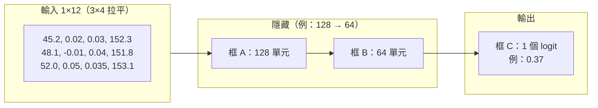
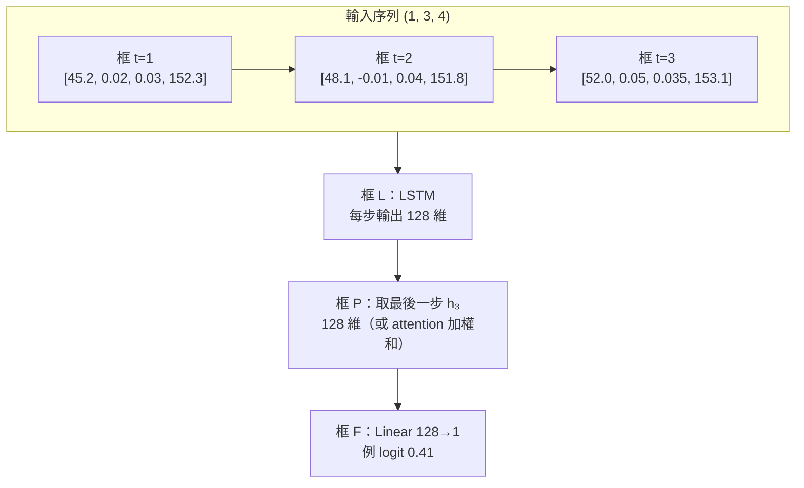
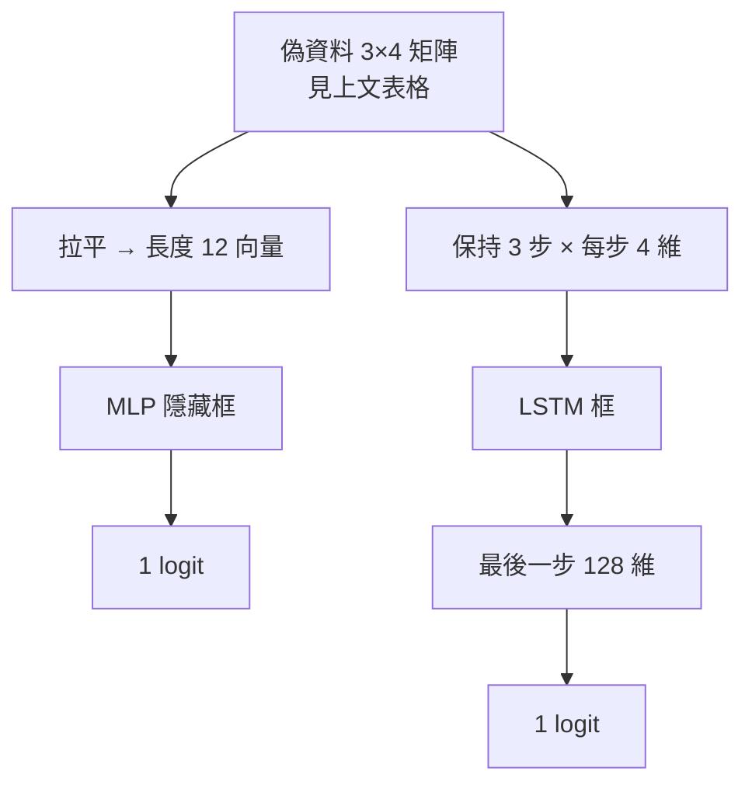

# MLP 與 LSTM：偽資料例子與高層圖（Mermaid）

本專案實作為 **LSTM**（見 `train_stock.py` 的 `LSTMDir`）。以下用**同一組偽資料**對照說明典型 **MLP** 與 **LSTM** 的輸入形狀與資料流。

為了圖好讀，範例用 **3 個時間步 × 4 個特徵**；實際訓練預設為 **`window=30`**，特徵維度為 **`d_in = len(FEATS)`**（標準化後餵入模型）。

---

## 偽資料（輸入範例）

列 = 時間由舊到新，欄 = 簡化特徵（示意用，非專案完整 `FEATS`）：

| t | rsi  | macd   | bbw   | close  |
|---|------|--------|-------|--------|
| 1 | 45.2 | 0.020  | 0.030 | 152.30 |
| 2 | 48.1 | −0.010 | 0.040 | 151.80 |
| 3 | 52.0 | 0.050  | 0.035 | 153.10 |

標籤偽例：**下一期上漲** → `y = 1`。

---

## MLP：拉平成向量 → 幾層「框」

將上表 **按列串接** 成長度 **3×4 = 12** 的向量，再經全連接隱藏層，最後 **1 個 logit**（與二元分類一致）。

圖中的 **0.37** 僅為示意數字。

---

## LSTM：序列框 → LSTM → 彙總框 → 輸出框

輸入保持 **(batch, 時間步, 特徵)**；與專案一致：LSTM **隱藏維度 128**，預設取 **最後一步**（或使用 `--use_attn` 做加權彙總），再 **Linear 128→1**。

圖中的 **0.41** 僅為示意數字。

---

## 同一組偽資料：兩條路對照

---

## 與本專案實作的對應

| 項目       | 本專案（`LSTMDir`）        |
|------------|----------------------------|
| 輸入形狀   | `(batch, window, d_in)`    |
| LSTM 隱藏維| 預設 `hid=128`             |
| 序列彙總   | 預設最後一步；可選 attention |
| 輸出       | `Linear(hid, 1)` → logit   |
| 損失       | `BCEWithLogitsLoss`        |

訓練產物中的 `meta.json` 會記錄實際 **`features`** 列表，其長度即 **`d_in`**。
